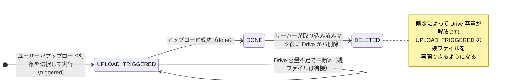
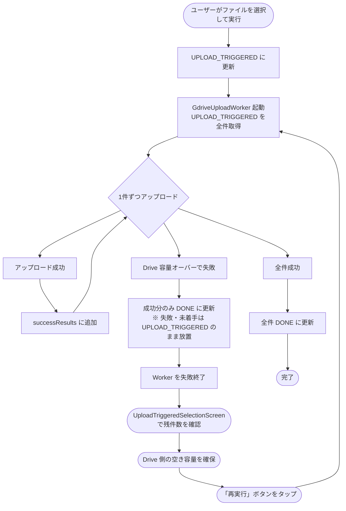
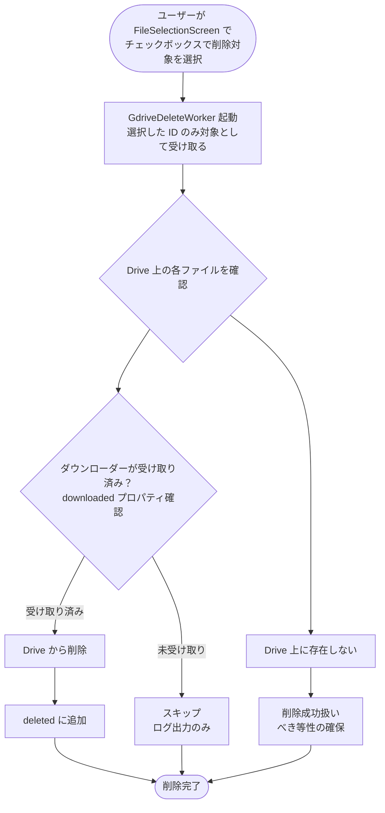
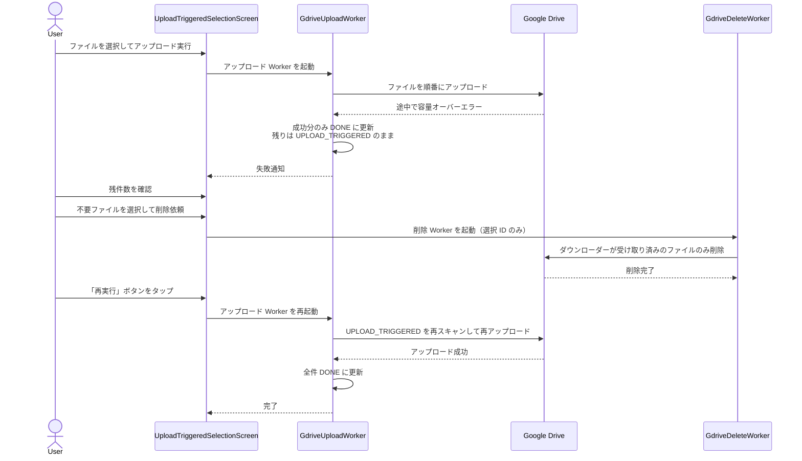
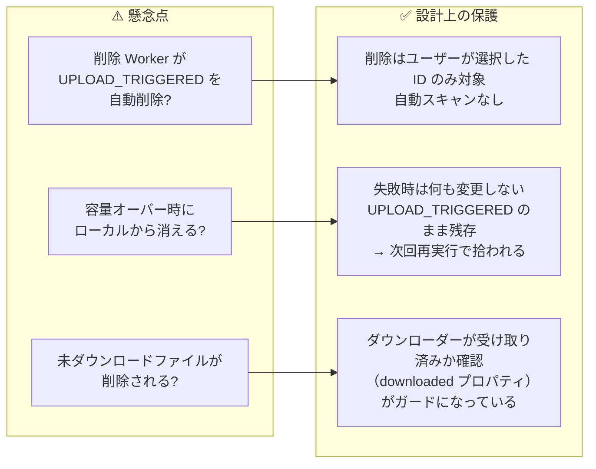

# アップロードと削除の関係

## 概要

アップロード（`GdriveUploadWorker`）と削除（`GdriveDeleteWorker`）は**完全に独立した手動操作**であり、
どちらか一方がもう一方のデータを自動的に巻き込むことはない。

---

## UploadState の状態遷移

---

## アップロードの挙動（GdriveUploadWorker）

> **Drive 容量を空けてから再実行ボタンを押すだけでよい。**
> ローカルの `UPLOAD_TRIGGERED` レコードが残っている限り何度でも再試行できる。

---

## 削除の挙動（GdriveDeleteWorker）

`UPLOAD_TRIGGERED` 状態のファイルを自動的にスキャンして削除することはない。

> **アップロードしたがまだダウンローダー側で受け取られていないファイルは削除されない。**

---

## 容量オーバー時の推奨運用手順

---

## まとめ：アップロードと削除が干渉しない理由

